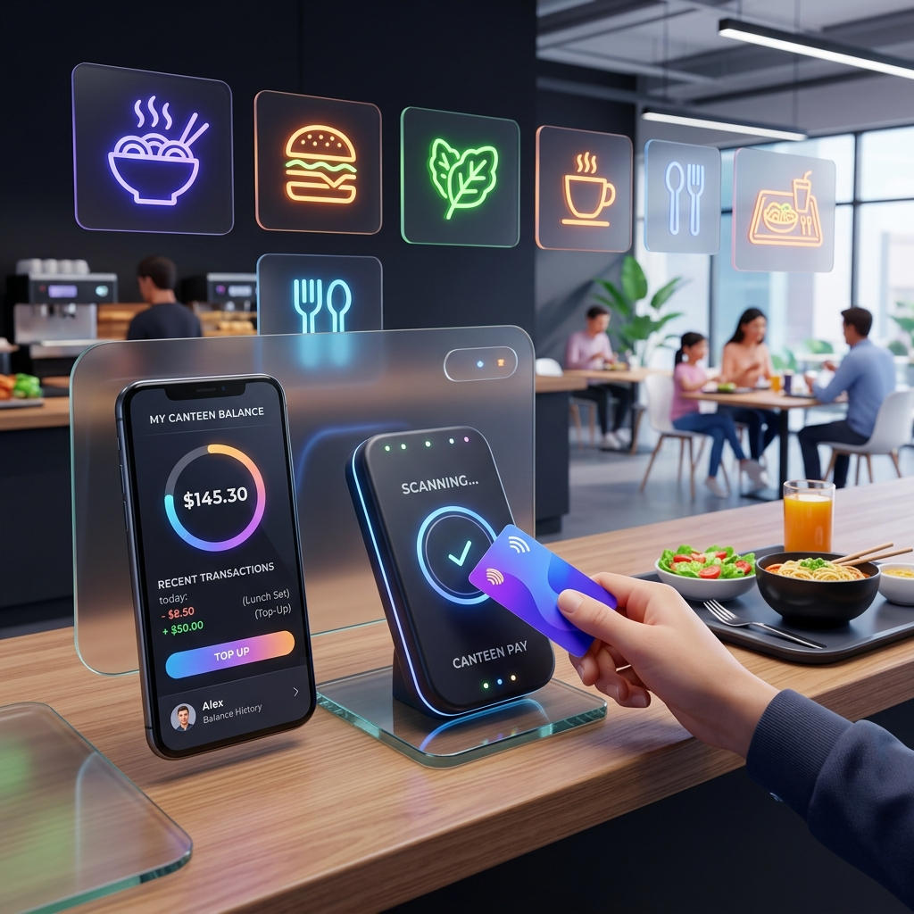

# 🍱 Kantin Digital RFID & NFC

[](https://laravel.com)
[](https://firebase.google.com)
[](https://midtrans.com)

Sistem Kantin Digital modern berbasis RFID (Radio Frequency Identification) dan NFC untuk efisiensi transaksi, manajemen saldo siswa, dan pemantauan penjualan secara real-time.



## 🚀 Fitur Unggulan

- **Tap-to-Pay**: Transaksi super cepat menggunakan kartu RFID atau tag NFC.
- **Top-up Mandiri**: Pengisian saldo otomatis via **Midtrans** (Virtual Account, E-Wallet, QRIS).
- **System Settings UI**: Konfigurasi API Midtrans dan nama aplikasi langsung melalui Dashboard Admin tanpa menyentuh file `.env`.
- **Real-time Monitoring**: Dashboard kasir yang terupdate otomatis menggunakan **Firebase Realtime Database**.
- **Manajemen User & Kartu**: Pendaftaran kartu RFID siswa yang mudah oleh Admin.
- **Riwayat Transaksi**: Lacak setiap transaksi masuk dan keluar secara detail.

## 🛠️ Tech Stack

### Web Application (Backend & Frontend)
- **Framework**: Laravel 11
- **Database**: MySQL (Main) & Firebase Realtime Database (Event Polling)
- **Payment Gateway**: Midtrans Snap API
- **Styling**: Vanilla CSS with Modern Glassmorphism UI
- **Icons**: Lucide Icons

### Hardware (IoT)
- **Microcontroller**: ESP32
- **Sensor**: RFID-RC522
- **Protocol**: Firebase Stream / REST API


## 📋 Persiapan Instalasi

### Prasyarat
- PHP >= 8.2
- Composer
- Node.js & NPM
- MySQL Database
- Akun Midtrans (Sandbox recommended)
- Firebase Project (Realtime Database)

### Langkah-langkah

1. **Clone Repository**
   ```bash
   git clone https://github.com/dimasalgh68-ship-it/kasir_rfid.git
   cd kasir_rfid
   ```

2. **Instal Dependensi**
   ```bash
   composer install
   npm install && npm run build
   ```

3. **Konfigurasi Environment**
   Salin file `.env.example` menjadi `.env` dan sesuaikan kredensial berikut:
   - Database (DB_DATABASE, DB_USERNAME, etc)
   - Midtrans (MIDTRANS_SERVER_KEY, MIDTRANS_CLIENT_KEY)
   - Firebase (FIREBASE_PROJECT_ID, FIREBASE_DATABASE_URL, etc)

4. **Migrasi Database**
   ```bash
   php artisan migrate --seed
   ```

5. **Jalankan Listener Firebase**
   Buka terminal baru untuk memantau scan RFID dari ESP32:
   ```bash
   php artisan firebase:listen
   ```

6. **Jalankan Aplikasi**
   ```bash
   php artisan serve
   ```

## 🔌 Integrasi ESP32

Pastikan ESP32 dikonfigurasi untuk mengirimkan UID kartu ke endpoint Firebase yang sesuai. Dokumentasi kode ESP32 dapat ditemukan di folder `/esp32`.

---

<p align="center">
  Dibuat dengan ❤️ untuk kemajuan digitalisasi kantin sekolah.
</p>
